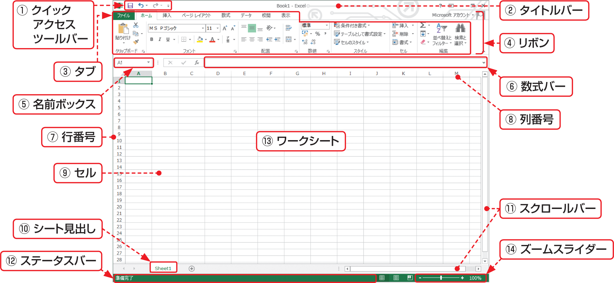

# Section 03 Excelの画面構成とブックの構成

## 基本的な画面構成

|名　称|機　能|
|:-----------||:-----------|
|&#9312; クイックアクセスツールバー|頻繁に使うボタンが表示されています。ボタンの追加や削除などもできます。|
|&#9313; タイトルバー|作業中のファイル名を表示しています。|
|&#9314; タブ|初期状態では、8つのタブが用意されています。クリックしてタブを切り替えます。|
|&#9315; リボン|従来のメニューとツールバーの代わりになる機能。コマンドを一連のタブに整理して表示します。|
|&#9316; 名前ボックス|現在選択されているセルのセル番地（列番号と行番号によってセルの位置を表したもの）またはセル範囲の名前を表示します。|
|&#9317; 数式バー|現在選択されているセルのデータまたは数式を表示します。|
|&#9318; 行番号|行の位置を示す数字を表示しています。|
|&#9319; 列番号|列の位置を示すアルファベットを表示しています。|
|&#9320; セル|表のマス目です。操作の対象となっているセルを「アクティブセル」といいます。|
|&#9321; シート見出し|シートを切り替える際に使用します。＜新しいシート＞ボタンをクリックすると、新しいワークシートが挿入されます。|
|&#9322; スクロールバー|シートを縦横にスクロールする際に使用します。|
|&#9323; ステータスバー|操作の説明や現在の処理の状態などを表示します。カスタマイズすることもできます。|
|&#9324; ワークシート|Excel 2013の作業スペースです。|
|&#9325; ズームスライダー|つまみをドラッグするか、縮小、拡大をクリックして、シートの倍率を変更します。|
